# Guia para la ejecución local de Apuntes App

## Prerrequisitos:
- Tener instalado Python. (La versión recomendada es **Python 3.11.9**. Esto debido a que en las versiones 3.12 y 3.13 se requiere descargar las Visual Studio Build Tools para poder instalar las dependencias de la app)
- (Opcional) Tener instalado Visual Studio Code.

## Paso 1: Clonar o descargar este repositorio en tu computadora.

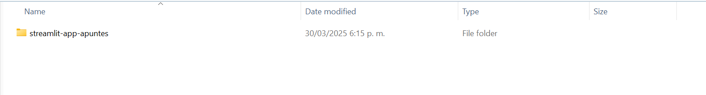

## Paso 2: Abre el repositorio con un editor de código (Se recomienda Visual Studio Code).

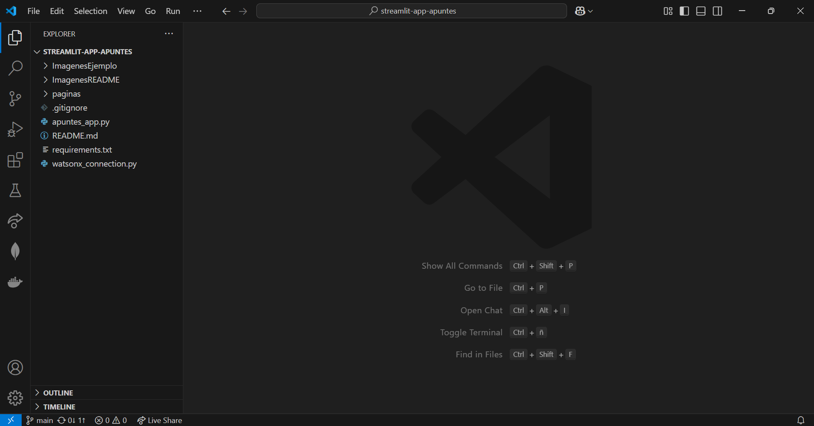

## Paso 3: Crear un archivo _.env_ con las variables de entorno necesarias para acceder a WatsonX.

### Paso 3.1: Crear el archivo _.env_ en la carpeta del proyecto.

Se debe crear un archivo que unicamente se llame _.env_ en la carpeta del proyecto. Es recomendable crearlo desde Visual Studio Code, para asegurar se que el nombre del archivo sea unicamente _.env_

Tras crear el archivo, el proyecto deberia verse de la siguiente manera:

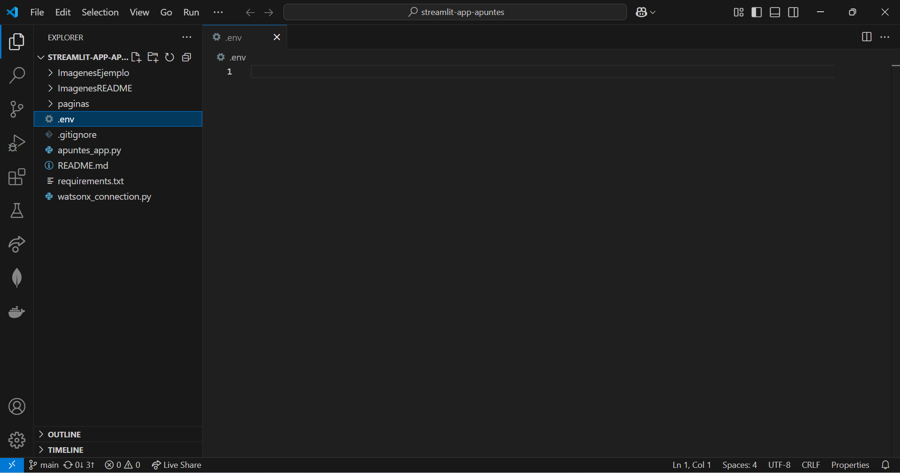

### Paso 3.2: Escribir las variables de entorno necesarias en el archivo _.env_:

Las variables de entorno que se deben escribir son las siguientes:

```python
WATSONX_API_KEY = 
IBM_CLOUD_URL = https://us-south.ml.cloud.ibm.com
WATSONX_PROJECT_ID = 
```

Se deben copiar estas tres variables dentro del archivo _.env_ del proyecto:

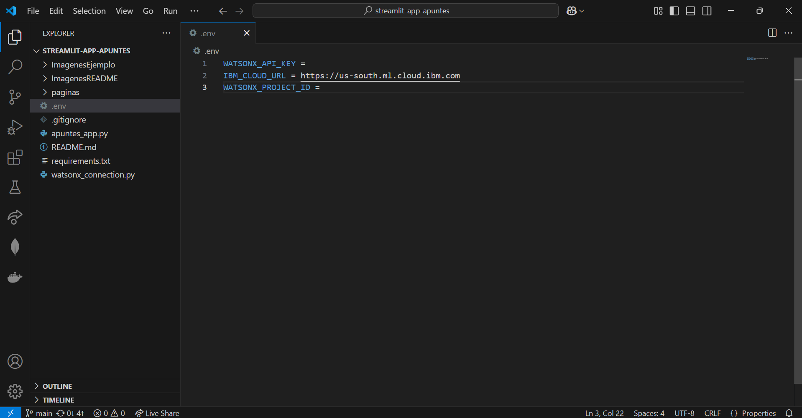

Tras esto, debe escribir el API_KEY y el Project_ID que le entreguen los tutores durante el taller en las variables WATSONX_API_KEY y WATSONX_PROJECT_ID respectivamente.

Un ejemplo de cómo deberia verse el archivo _.env_ tras incluir los valores dados por los tutores es el siguiente:

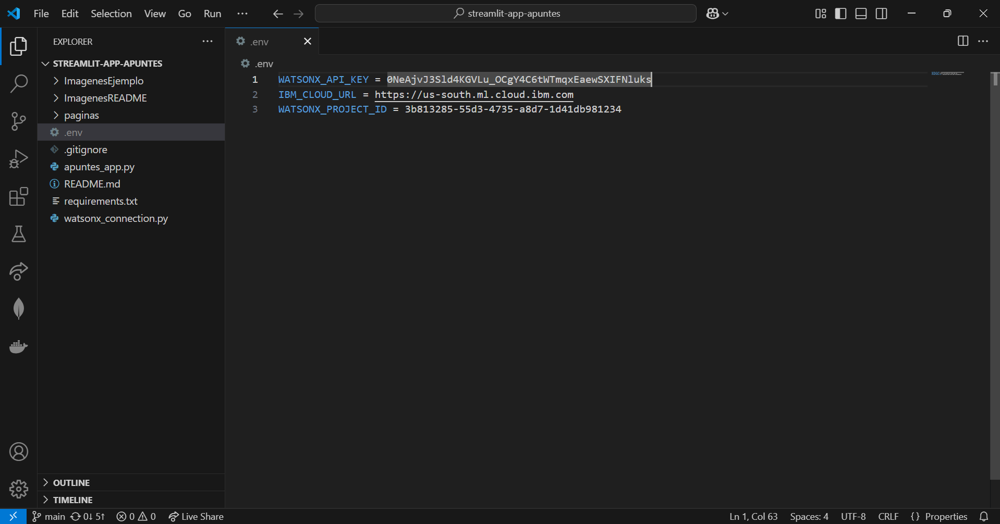

### Paso 3.3: Guardar y cerrar el archivo _.env_

## Paso 4: Crear un entorno virtual de Python para ejecutar la aplicación. 

Adventencia: Los pasos mostrados a continuación fueron realizados en un equipo con Windows. Para otros sistemas operativos los comandos pueden variar un poco.

### Paso 4.1: Crear una terminal ubicada en la carpeta del proyecto:

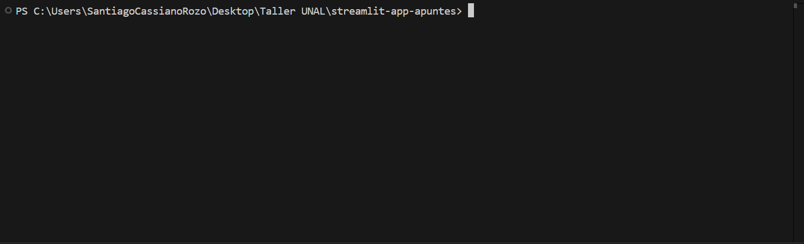

### Paso 4.2: Verificar las versiones de Python instaladas en su computadora.

Para verificar la versión de python instalada en el equipo se puede usar el comando:

```console
py --list
```

En la consola se deberia ver una lista de las versiones de Python instaladas. Por ejemplo, en este caso unicamente se tienen instaladas la version 3.11 y 3.12:

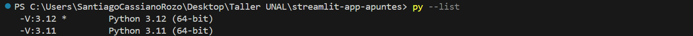

### Paso 4.3: Crear el entorno virtual con una version de Python espefica:

Para crear un entorno virtual con nombre _.venv_ se debe usar el siguiente comando, donde la X se debe remplazar por la versión de Python con la que se quiere crear el entorno virtual:

```console
py -3.X -m venv .venv
```

Por ejemplo, para el caso de Python 3.11 (que es la version recomendada) seria:

```console
py -3.11 -m venv .venv
```

Tras ejecutar el comando debio crearse la carpeta _.venv_ dentro del proyecto:

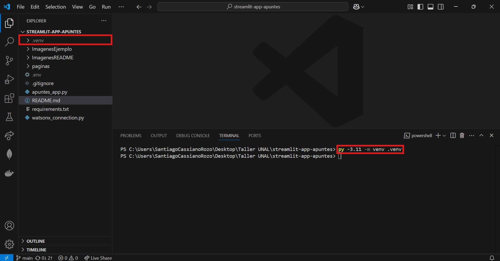

## Paso 5: Activar el entorno virtual en una consola:

### Paso 5.1: Tener una terminal ubicada en la carpeta del proyecto:


### Paso 5.2: Activar el entorno virtual en la terminal

Para activar el entorno virtual se debe ejecutar el siguiente comando en la terminal de Powershell:

```console
.\.venv\Scripts\activate.ps1
```

En caso de que sea una terminal de comandos de Windows se puede ejecutar: 
```console
.\.venv\Scripts\activate.bat
```

Tras ejecutar el comando en la parte izquierda de la terminal deberia verse el nombre del entorno virtual activado:

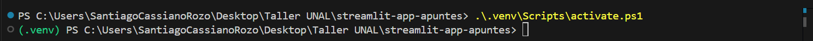

## Paso 6: Instalar las dependencias necesarias en el entorno virtual

### Paso 6.1: Tener una terminal ubicada en la carpeta del proyecto y con el entorno virtual activado:


### Paso 6.2: Instalar las dependencias escritas en el archivo requirements.txt

Para instalar las dependencias se debe usar el siguiente comando en la terminal:

```console
pip install -r requirements.txt
```

En la terminal empezarán a instalarse varios paquetes, puede que este proceso tome alrededor de 10 minutos.

### Paso 7: Ejecutar la aplicación de streamlit

### Paso 7.1: Tener una terminal ubicada en la carpeta del proyecto y con el entorno virtual activado:


### Paso 7.2: Iniciar la aplicación de streamlit

Se debe ejecutar el siguiente comando en la terminal:

```console
streamlit run apuntes_app.py
```

Tras esto debe salir el siguiente mensaje en la terminal:

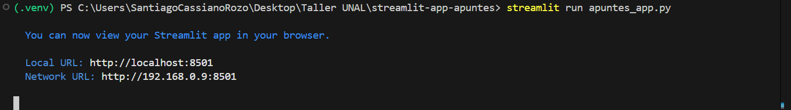

Y en el navegador al ir a la dirección [http://localhost:8501](http://localhost:8501) debe salir el inicio de la aplicación:

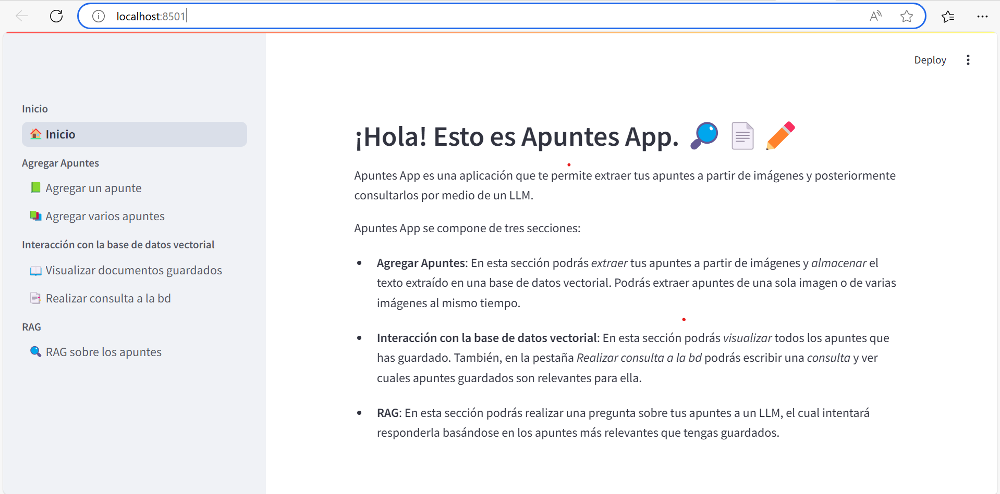

## Bonus:
Para detener la aplicación debe oprimir CTRL+C en la terminal donde estaba ejecutando la aplicación. Es importante que cuando haga esto la aplicación tambien este abierta en el navegador.

Otra forma de detener la aplicación es cerrar o eliminar la terminal en donde se estaba ejecutando.
